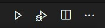
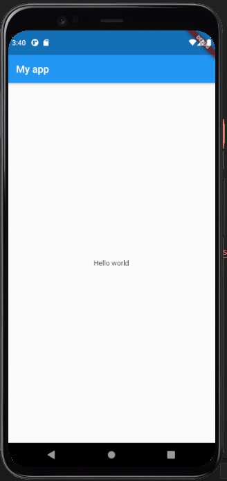
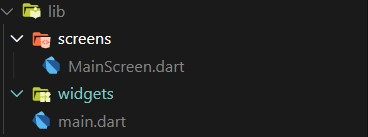
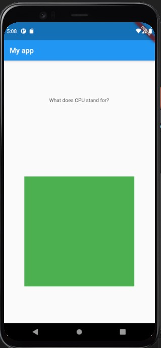
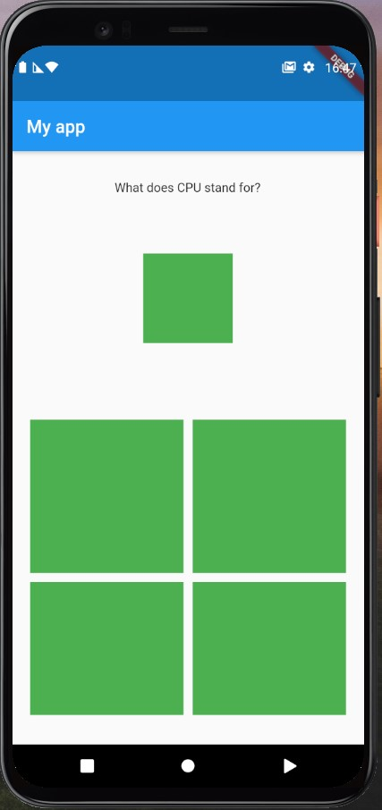
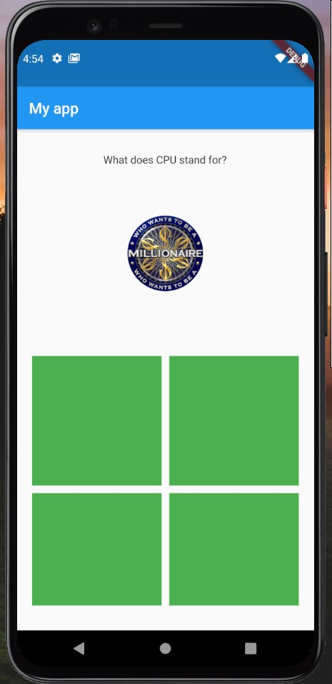
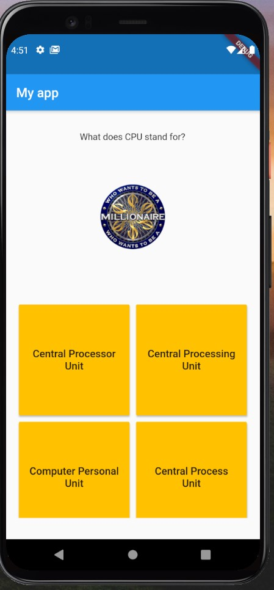

summary: Write your First flutter app
id: docs
categories: Flutter
tags: beginner
status: Published 
authors: Roei Bracha
Feedback Link: https://petetot.netlify.com


<!-- Trivia API: -->
<!-- https://opentdb.com/api_config.php -->


# Write your First flutter app
<!-- ------------------------ -->
## Installing Flutter 
Duration: 30


### Installing flutter

You need two pieces of software to complete this lab—the [Flutter SDK](https://flutter.io/get-started/install/) and [an editor](https://code.visualstudio.com/). (The codelab assumes that you're using Visual Studio Code, but you can use your preferred editor.)

  

### 👨‍💻 Flutter SDK

to work with flutter, first of all, you will have to install the Flutter SDK on your computer you can read how to install it from the [flutter documentation](https://flutter.dev/docs/get-started/install/windows#get-the-flutter-sdk)

#### how to install the SDK:
- create an src folder under C:\ :
`mkdir C:\src`

- run the following commands on the terminal:
`cd C:\src`
`git clone https://github.com/flutter/flutter.git -b stable`

#### update your path ([also avilable here)](https://flutter.dev/docs/get-started/install/windows#update-your-path):

 -  From the Start search bar, enter ‘env’ and select  **Edit environment variables for your account**.
 - Under **User variables** check if there is an entry called **Path**:
	-   If the entry exists, append the full path to  `C:\src\flutter\bin`  using  `;`  as a separator from existing values.
	-   If the entry doesn’t exist, create a new user variable named  `Path`  with the full path to  `C:\src\flutter\bin`  as its value.

### Android Studio
to develop an app for Android, we will need to install the Android SDK Build-Tools and an Android emulator to check our app, so first of all, install android studio:
1.  Download and install [Android Studio](https://developer.android.com/studio).
2.  Start Android Studio, and go through the 'Android Studio Setup Wizard'. This installs the latest Android SDK, Android SDK Command-line Tools, and Android SDK Build-Tools, which are required by Flutter when developing for Android.

### 📱 Android emulator:
we will need a place to run our app and test it, and for that, you can use one of the two options:

 1. [An emulator  - recommended](https://flutter.dev/docs/get-started/install/windows#set-up-the-android-emulator)
 2. [Run on your on device](https://flutter.dev/docs/get-started/install/windows#set-up-your-android-device)

💡 this part can be a little hard if you are using an old PC - make sure that your computer support virtualization and that it is enabled in your BIOS
if you have any problems, use flutter doctor and google for your help 🦸‍♂️

### Visual Studio Code - Flutter extension
install the flutter extension for Visual Studio Code from [here](https://marketplace.visualstudio.com/items?itemName=Dart-Code.flutter)

### 👨‍⚕️ Flutter Doctor :
flutter Doctor is your best friend when you are installing Flutter
after updating your path, close your terminal and re-open it
now run the command:
you need to See green checks like that:
✅ Flutter
✅  Android toolchain
✅ VS Code

### 🌐 Enable Web - optional :
If you want to compile your app to run on the web, you must enable this feature (which is currently in beta). To enable web support, use the following instructions:
```bash
$ flutter channel beta
$ flutter upgrade
$ flutter config --enable-web
```
------------------------
## Hello World
Duration: 5

1. Open Visual Studio Code and press `Ctrl + Shift + p` and type `Flutter: New Application Project.`
and choose where do you want to create your app.

2. Now we have the sample project
try to run the app with the little play icon in your visual studio code (at the top right corner).



1. Delete all the code from the  `main.dart` file and replace it with the following code:
   ```dart
   import 'package:flutter/material.dart';

    void main() {
    runApp(MyApp());
    }

    class MyApp extends StatelessWidget {
    // This widget is the root of your application.
    @override
    Widget build(BuildContext context) {
        return MaterialApp(
        title: 'Flutter Demo',
        theme: ThemeData(
            primarySwatch: Colors.blue,
            visualDensity: VisualDensity.adaptivePlatformDensity,
        ),
        home: MyHomePage(),
        );
    }
    }

    class MyHomePage extends StatelessWidget {
    const MyHomePage({Key key}) : super(key: key);

    @override
    Widget build(BuildContext context) {
        return Scaffold(
        appBar: AppBar(
            title: Text("My app"),
        ),
        body: Container(
            child: Center(
            child: Text("Hello world"),
            ),
        ),
        );
        }
    }
   ```



### So what do we have here:
   ```dart
   void main() {
    runApp(MyApp());
    }
   ```
this part at the begining is where we tell flutter to run Our app:

```dart
   class MyApp extends StatelessWidget {
    @override
    Widget build(BuildContext context) {
        return MaterialApp(
        title: 'Flutter Demo',
        theme: ThemeData(
            primarySwatch: Colors.blue,
            visualDensity: VisualDensity.adaptivePlatformDensity,
        ),
        home: MyHomePage(),
        );
    }
    }
```
the app like any other thing in Flutter is a stetless Widget where we return a [MaterialApp](https://api.flutter.dev/flutter/material/MaterialApp-class.html) Widget
MaterialApp - is A widget that contains an application that uses material design.

in this Widget we define the app theme and set what is our home screen - in this case the `MyHomePage` widget:

```dart
class MyHomePage extends StatelessWidget {
  const MyHomePage({Key key}) : super(key: key);

  @override
  Widget build(BuildContext context) {
    return Scaffold(
      appBar: AppBar(
        title: Text("My app"),
      ),
      body: Container(
        child: Center(
          child: Text("Hello world"),
        ),
      ),
    );
  }
}
```

In this widget we are building our first Screen.
To make it easier we use [Scaffold](https://api.flutter.dev/flutter/material/Scaffold-class.html) a widget that implements the basic material design visual layout structure.

we crate an app bar and set a title with the Text "My app"
under body we will add our app page - in this case a [Container](https://api.flutter.dev/flutter/widgets/Container-class.html) with the text hello world centred in the center of the screen

### Extra :


<!-- ------------------------ -->
## Order our directory
Duration: 5

To make sure our app stay organize crate two folders under the `lib` folder:
* widget
* screens

now we will create a new File in The screens folder and call it `MainScreen.dart`

in this file start writing `statelessW` and use the suggested snippet to create an Empty Widget

```dart
class name extends StatelessWidget {
  const name({Key key}) : super(key: key);

  @override
  Widget build(BuildContext context) {
    return Container(
      child: child,
    );
  }
}
```
change the name to `MainScreen` and when you in the first line press `Ctrl + .` or the little bulb 💡 and choose `import library 'package:flutter/material.dart'`
cut your widget from the `main.dart` file and paste in this file:

```dart
import 'package:flutter/material.dart';

class MainScreen extends StatelessWidget {
  const MainScreen({Key key}) : super(key: key);

  @override
  Widget build(BuildContext context) {
    return Scaffold(
      appBar: AppBar(
        title: Text("My app"),
      ),
      body: Container(
        child: Center(
          child: Text("Hello world"),
        ),
      ),
    );
  }
}
```

now we will go to the `main.dart` file and delete the `MyHomePage` Widget
and replace home widget with the MainScreen like that:
(VScode should auto import the mainScreen file for you)
```dart
import 'package:flutter/material.dart';
import 'package:my_game/screens/MainScreen.dart';

void main() {
  runApp(MyApp());
}

class MyApp extends StatelessWidget {
  // This widget is the root of your application.
  @override
  Widget build(BuildContext context) {
    return MaterialApp(
      title: 'Flutter Demo',
      theme: ThemeData(
        primarySwatch: Colors.blue,
        visualDensity: VisualDensity.adaptivePlatformDensity,
      ),
      home: MainScreen(),
    );
  }
}

```

your directory in the end Should look like that:


<!-- ------------------------ -->
## Screen Arrangement 
Duration: 10

in this Section we will create the Question Widget and in the end it will look look that:


### plan before you write

As you can see we have three big elemnts in a column:
* The Question
* Options

in the Options we have a Grid of four buttons - with a centered text

### Create the Question Widget:

create a new widget in the Widgets folder and cal it `question.dart`
and make it return a Column
```dart
import 'package:flutter/material.dart';

class Question extends StatelessWidget {
  const Question({Key key}) : super(key: key);

  @override
  Widget build(BuildContext context) {
    return Column(
      children: [],
    );
  }
}
```

to make sure we will see what we are doing add the widget to our screen `MainScreen.dart`:

```dart
import 'package:flutter/material.dart';
import 'package:my_game/widgets/question.dart';

class MainScreen extends StatelessWidget {
  const MainScreen({Key key}) : super(key: key);

  @override
  Widget build(BuildContext context) {
    return Scaffold(
      appBar: AppBar(
        title: Text("My app"),
      ),
      body: Container(
        child: Question(),
      ),
    );
  }
}
```


lets store the Question, the Image Url and the answers in the widgets as properties
and remove the delete the const in fronnt of the Question constructor

this Widget will be a little different every time - we add the const only if the widget have a strict state in compilation time

 `question.dart`:
```dart
import 'package:flutter/material.dart';

class Question extends StatelessWidget {
  final question_text = "What does CPU stand for?";
  final correct_answer = "Central Processing Unit";
  final incorrect_answers = [
    "Central Process Unit",
    "Computer Personal Unit",
    "Central Processor Unit"
  ];

  Question({Key key}) : super(key: key);

  @override
  Widget build(BuildContext context) {
    return Column(
      children: [],
    );
  }
}

```

now we will add the question Text and an empty Container that in the feautre will contain the results
we would like to make them withe equal space from the top so we will add to the column: `mainAxisAlignment: MainAxisAlignment.spaceAround,`
and top make them in the center of the page we will add `crossAxisAlignment: CrossAxisAlignment.center`

```dart
import 'package:flutter/material.dart';

class Question extends StatelessWidget {
  final question_text = "What does CPU stand for?";
  final correct_answer = "Central Processing Unit";
  final incorrect_answers = [
    "Central Process Unit",
    "Computer Personal Unit",
    "Central Processor Unit"
  ];

  Question({Key key}) : super(key: key);

  @override
  Widget build(BuildContext context) {
    return Column(
      mainAxisAlignment: MainAxisAlignment.spaceAround,
      crossAxisAlignment: CrossAxisAlignment.center,
      children: [
        Text(this.question_text),
        Container(
          color: Colors.green,
          height: 100,
          width: 100,
        )
      ],
    );
  }
}
```
It will look like that:


so we have the main axies look good but why its not centered?

the reason is that it is centered in the middle of the column but the column dosent take the all width of the screen
to fix that we will wrap the column with Container and give this container `width:double.infinity` so the container will be in the width of the all screen.
💡 tip - you can press the bulb or `Ctrl + .` when you on the column and choose wrap with container.



```dart
import 'package:flutter/material.dart';

class Question extends StatelessWidget {
  final question_text = "What does CPU stand for?";
  final correct_answer = "Central Processing Unit";
  final incorrect_answers = [
    "Central Process Unit",
    "Computer Personal Unit",
    "Central Processor Unit"
  ];

  Question({Key key}) : super(key: key);

  @override
  Widget build(BuildContext context) {
    return Container(
      width: double.infinity,
      child: Column(
        mainAxisAlignment: MainAxisAlignment.spaceAround,
        crossAxisAlignment: CrossAxisAlignment.center,
        children: [
          Text(this.question_text),
          Container(
            color: Colors.green,
            height: 100,
            width: 100,
          ),
        ],
      ),
    );
  }
}

```


Below that we will want to add the grid of answers so we will add the `GridView` Widget inside a container and create a grid of 2x2:

```dart
import 'package:flutter/material.dart';

class Question extends StatelessWidget {
  final question_text = "What does CPU stand for?";
  final correct_answer = "Central Processing Unit";
  final incorrect_answers = [
    "Central Process Unit",
    "Computer Personal Unit",
    "Central Processor Unit"
  ];

  Question({Key key}) : super(key: key);

  @override
  Widget build(BuildContext context) {
    return Container(
      width: double.infinity,
      child: Column(
        mainAxisAlignment: MainAxisAlignment.spaceAround,
        crossAxisAlignment: CrossAxisAlignment.center,
        physics: NeverScrollableScrollPhysics(),
        children: [
          Text(this.question_text),
          Container(
            color: Colors.green,
            height: 100,
            width: 100,
          ),
          Container(
            height: 350,
            child: GridView.count(
                crossAxisCount: 2,
                primary: false,
                padding: const EdgeInsets.all(20),
                crossAxisSpacing: 10,
                mainAxisSpacing: 10,
                children: <Widget>[
                  Container(
                  color: Colors.green,
                ),Container(
                  color: Colors.green,
                ),
                  Container(
                    color: Colors.green,
                  ),
                  Container(
                    color: Colors.green,
                  ),]
            ),
          )
        ],
      ),
    );
  }
}
```

So it will look like that:




<!-- ------------------------ -->
## Adding images
Duration: 5

now let say we want to replace the green square in the middle with an image.
first of all we will have to add the picture to the assets folder.
download the picture and save it in `assets/images/milli.png`


now go to your `pubspec.yaml` and you will see the following comment:
```yaml
  # To add assets to your application, add an assets section, like this:
  # assets:
  #   - images/a_dot_burr.jpeg
  #   - images/a_dot_ham.jpeg
```

uncomment the assets and add the path to the picture:

```yaml
  assets:
   - assets/images/milli.png
```

now in the code we will insert the image inside our Container:
```dart
  Container(
    height: 100,
    width: 100,
    child: Image.asset('assets/images/milli.png'),
  ),
```

the image asset will automaticly take the size of the container that contains the widget

Positive
: You can use multiple types of Images like `Image.network` to load an image from the web.

your app should look like that right now:



## Answer Widget
Duration: 10

Create a new Widget: `AnswerButton.dart`
this widget will be our Answer button.

This Widget will get a String that will represent the answer and a function to use on press.
`AnswerButton.dart`
```dart
import 'package:flutter/material.dart';

class AnswerButton extends StatelessWidget {
  final String text;
  final Function onPress;

  AnswerButton({this.text, this.onPress, Key key}) : super(key: key);

  @override
  Widget build(BuildContext context) {
    return RaisedButton(
      color: Theme.of(context).accentColor,
      child: Text(
        text,
        textAlign: TextAlign.center,
        style: TextStyle(fontSize: 16),
      ),
      onPressed: this.onPress,
    );
  }
}
```

As you can see In this Widget we get two arguments - the text and the function, so we need to add them in the class properties and add them to the Constructor.

Positive
: Instead of creating the same `RaisedButton` for times and add the style for every one of them, we crate our own Widget and style it only once.

In this widget I set the RaisedButton color to be taken from the app Theme.
you can try to change the colors of the app theme in the `main.dart` file and see how the all app colors are changing.
`main.dart`
```dart
class MyApp extends StatelessWidget {
  // This widget is the root of your application.
  @override
  Widget build(BuildContext context) {
    return MaterialApp(
      title: 'Flutter Demo',
      theme: ThemeData(
        primarySwatch: Colors.blue,
        accentColor: Colors.amber,
        visualDensity: VisualDensity.adaptivePlatformDensity,
      ),
      home: MainScreen(),
    );
  }
}
```


Now we will replace one of the container in the Question Widget with our new Answer Button:
```dart
GridView.count(
                crossAxisCount: 2,
                physics: NeverScrollableScrollPhysics(),
                primary: false,
                padding: const EdgeInsets.all(20),
                crossAxisSpacing: 10,
                mainAxisSpacing: 10,
                children: <Widget>[
                  AnswerButton(text: "Answer",onPress: (){},),
                Container(
                  color: Colors.green,
                ),
                  Container(
                    color: Colors.green,
                  ),
                  Container(
                    color: Colors.green,
                  ),]
            ),
```

### Generate answers:

now we would like to generate the answers from the array of answers we have.
so we will add this logic to the build function before the return

to do so we will crate a List of Widgets that will contain our answers widgets:
```dart
List<Widget> answers = [];
    answers.add(AnswerButton(
      text: correct_answer,
      onPress: () {
        print(true);
      },
    ));
    incorrect_answers.forEach((ansString) {
      answers.add(AnswerButton(
        text: ansString,
        onPress: () {
          print(false);
        },
      ));
    });
```

in this case the current answer will always be the first one so we will shuffle the List with `answers.shuffle();`
```dart
List<Widget> answers = [];
    answers.add(AnswerButton(
      text: correct_answer,
      onPress: () {
        print(true);
      },
    ));
    incorrect_answers.forEach((ansString) {
      answers.add(AnswerButton(
        text: ansString,
        onPress: () {
          print(false);
        },
      ));
    });
    answers.shuffle();
```


now when we have the array of widget we can add it inside the the GridView children List:
```dart
GridView.count(
                crossAxisCount: 2,
                physics: NeverScrollableScrollPhysics(),
                primary: false,
                padding: const EdgeInsets.all(20),
                crossAxisSpacing: 10,
                mainAxisSpacing: 10,
                children: <Widget>[...answers]),
          )
```

your app should look like that right now:


`Question.dart`:
```dart
import 'package:flutter/material.dart';
import 'package:my_game/widgets/AnswerButton.dart';

class Question extends StatelessWidget {
  final question_text = "What does CPU stand for?";
  final correct_answer = "Central Processing Unit";
  final incorrect_answers = [
    "Central Process Unit",
    "Computer Personal Unit",
    "Central Processor Unit"
  ];

  Question({Key key}) : super(key: key);

  @override
  Widget build(BuildContext context) {
    List<Widget> answers = [];
    answers.add(AnswerButton(
      text: correct_answer,
      onPress: () {
        print(true);
      },
    ));
    incorrect_answers.forEach((ansString) {
      answers.add(AnswerButton(
        text: ansString,
        onPress: () {
          print(false);
        },
      ));
    });
    answers.shuffle();
    return Container(
      width: double.infinity,
      child: Column(
        mainAxisAlignment: MainAxisAlignment.spaceAround,
        crossAxisAlignment: CrossAxisAlignment.center,
        children: [
          Text(this.question_text),
          Container(
            height: 100,
            width: 100,
            child: Image.asset('assets/images/milli.png'),
          ),
          Container(
            height: 350,
            child: GridView.count(
                crossAxisCount: 2,
                physics: NeverScrollableScrollPhysics(),
                primary: false,
                padding: const EdgeInsets.all(20),
                crossAxisSpacing: 10,
                mainAxisSpacing: 10,
                children: <Widget>[...answers]),
          )
        ],
      ),
    );
  }
}
```

`AnswerButton.dart`:
```dart
import 'package:flutter/material.dart';

class AnswerButton extends StatelessWidget {
  final String text;
  final Function onPress;

  AnswerButton({this.text, this.onPress, Key key}) : super(key: key);

  @override
  Widget build(BuildContext context) {
    return RaisedButton(
      color: Theme.of(context).accentColor,
      child: Text(
        text,
        textAlign: TextAlign.center,
        style: TextStyle(fontSize: 16),
      ),
      onPressed: this.onPress,
    );
  }
}

```

## Game Logic
Duration: 0

So every thing is almost done - now we only have to insert the Game Logic
* generate new Question every Time
* Count the points

## Generate new Questions
Duration: 10

to generate the questions we will use this Trivia api:
[Trivia api](https://opentdb.com/api_config.php).

### Move the questions to the main screen:

First of all we would like to move the questions to the main screen and pass them to the the Question widget

change the `Question.dart` widget to get the question from the main screen:

```dart
class Question extends StatelessWidget {
  String question_text;
  String correct_answer;
  List<String> incorrect_answers;

  Question(
      {@required this.question_text,
      @required this.correct_answer,
      @required this.incorrect_answers,
      Key key})
      : super(key: key);

  @override
  Widget build(BuildContext context) {
  ...
  ...
```

And in the main screen we will pass the question:
```dart
Widget build(BuildContext context) {
    final question_text = "What does CPU stand for?";
    final correct_answer = "Central Processing Unit";
    final incorrect_answers = [
      "Central Process Unit",
      "Computer Personal Unit",
      "Central Processor Unit"
    ];
    return Scaffold(
      appBar: AppBar(
        title: Text("My app"),
      ),
      body: Container(
        child: Question(
          correct_answer: correct_answer,
          incorrect_answers: incorrect_answers,
          question_text: question_text,
        ),
      ),
    );
  }
```

To make the game dynamic and challenging we would like to change the question every time and hold dynamic data on the game in the main screen
for that we need to change the `MainScreen` widget to be a StatefulWidget widget.

go to the `MainScreen.dart` file click on the class name and you will see the little bulb in your VScode 💡 and choose convert to StatefulWidget
(if you dont see it you can press `Ctrl + .`)

in the main screen we would like to store the following data:
* questions - a list of the questions.
* index - the question number.
* points - how many points got.

so we will add it to the MainScreen Widget:
```dart
class _MainScreenState extends State<MainScreen> {
  int index = 0;
  List questions = [];
  int points = 0;

  @override
  Widget build(BuildContext context) {
    return Scaffold(
      ....

```
At the begining we dont have questions yet so we would like to shoLoading animation
crate a loading Widget:
`Loading.dart`:
```dart
import 'package:flutter/material.dart';

class Loading extends StatelessWidget {
  @override
  Widget build(BuildContext context) {
    return Center(
        child: Container(
            height: 100,
            width: 100,
            child: CircularProgressIndicator(
              strokeWidth: 10,
            )));
  }
}
```
and now we will tell the Main screen to show the loading indicator if the Question list length is 0

```dart
class _MainScreenState extends State<MainScreen> {
  int index = 0;
  List questions = [];
  int points = 0;

  @override
  Widget build(BuildContext context) {
    return Scaffold(
      appBar: AppBar(
        title: Text("My app"),
      ),
      body: Container(
        child: questions.length== 0 ? Loading(): Container(),
      ),
    );
  }
}
```

### Add http package
to create an http request we will have to add the http package to our project:
1. go to [Pub dev](https://pub.dev) and search for the `http` package ([the package](https://pub.dev/packages/http)).
2. follow the instructions in the installing tab:
   1. add the package to the dependencies in the `pubspec.yaml` file.
   2. if you use VScode it will automaticly install it when you will press enter
   but if it dosen't: `flutter pub get`
3. In the Example Tab you can see how to use the package.


